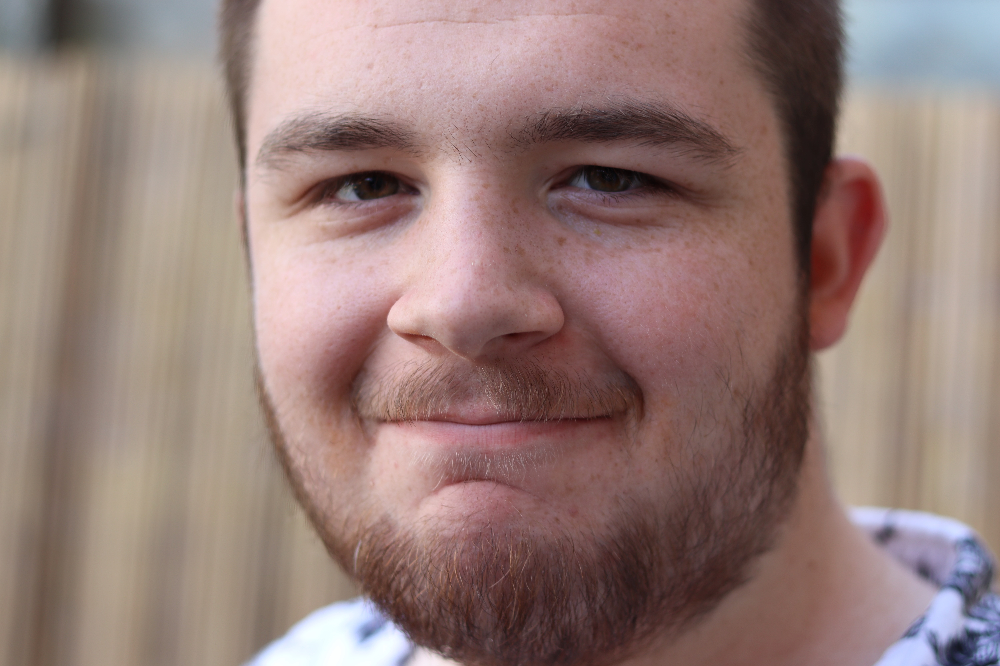

## Hi, I'm Steve *'Zed'* Muir.

I consider myself to be extremely lucky because I have found true love with my wonderful partner, Yasmin.  

<figcaption>Zed and Yasmin in Nuremberg</figcaption>

---

My son Freddy lives with us and has recently finished study at college. 

<figcaption>Freddy sporting a fine beard!</figcaption>

---

 We have a sweet little cat, Coco, who you will likely see somewhere in the blog entries. 

 
 <figcaption>Coco looking super cute</figcaption>

---

I enjoy learning to code and hope to transistion to a career in coding of some kind in the near future.  Currently only able to learn coding in any spare time I can find outside of working and spending time with my favourite people.  I originally started learning basic HTML and CSS back in 2010/11 due to a back injury requiring surgery.  I built my dad's website using oldschool methods (HTML table layouts!!) and after a decade-long break, updated it to HTML5 and CSS3.  

I also enjoy watching/learning chess, reading books and watching documentaries.  

## License

This blog has been built using the [Moonwalk](https://abhinavs.github.io/moonwalk/) theme created by [Abhinav Saxena](https://www.abhinav.co/about/).  

The theme is available as open source under the terms of the [MIT License](https://opensource.org/licenses/MIT).